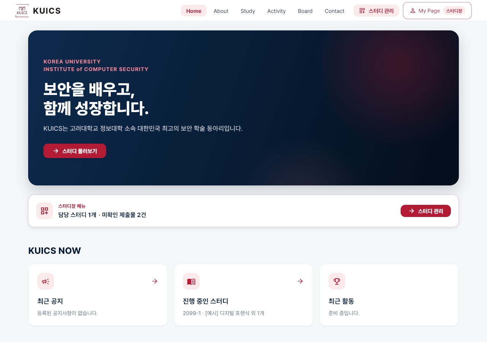
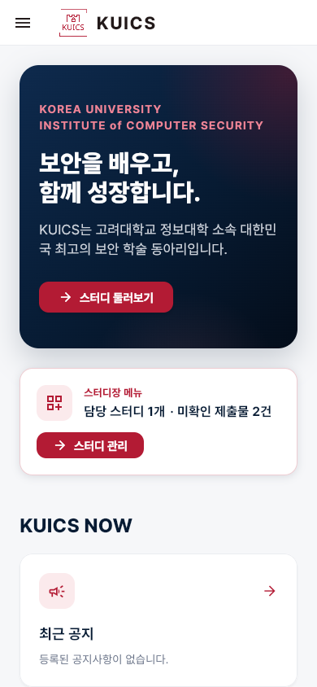
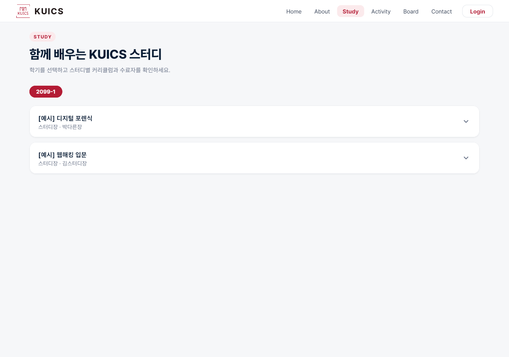
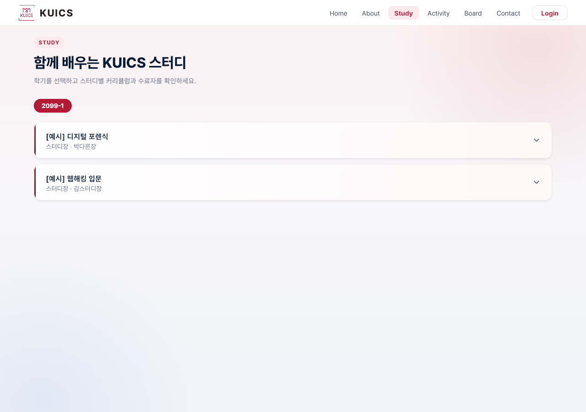
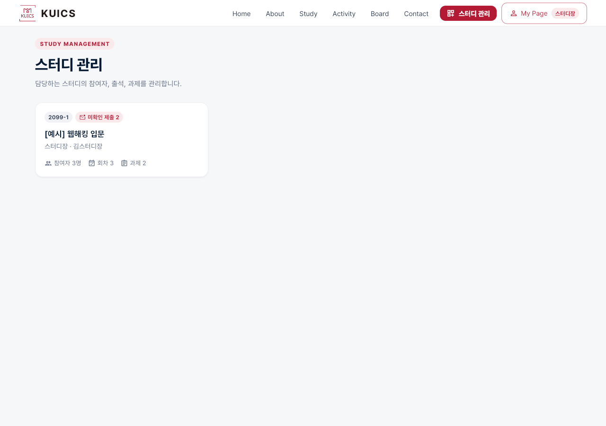
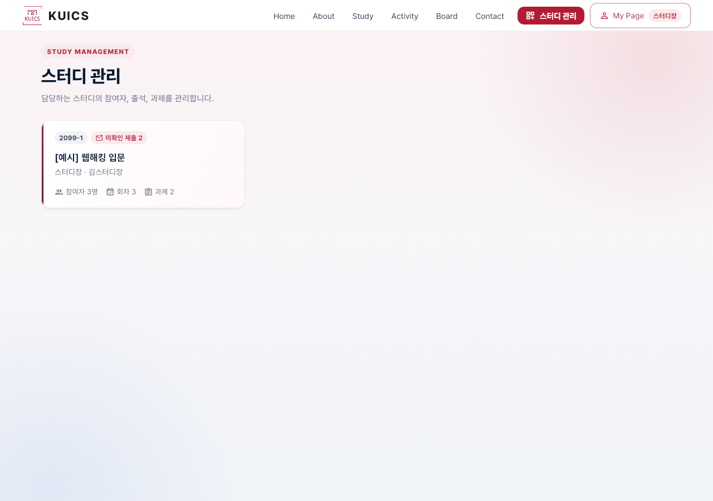
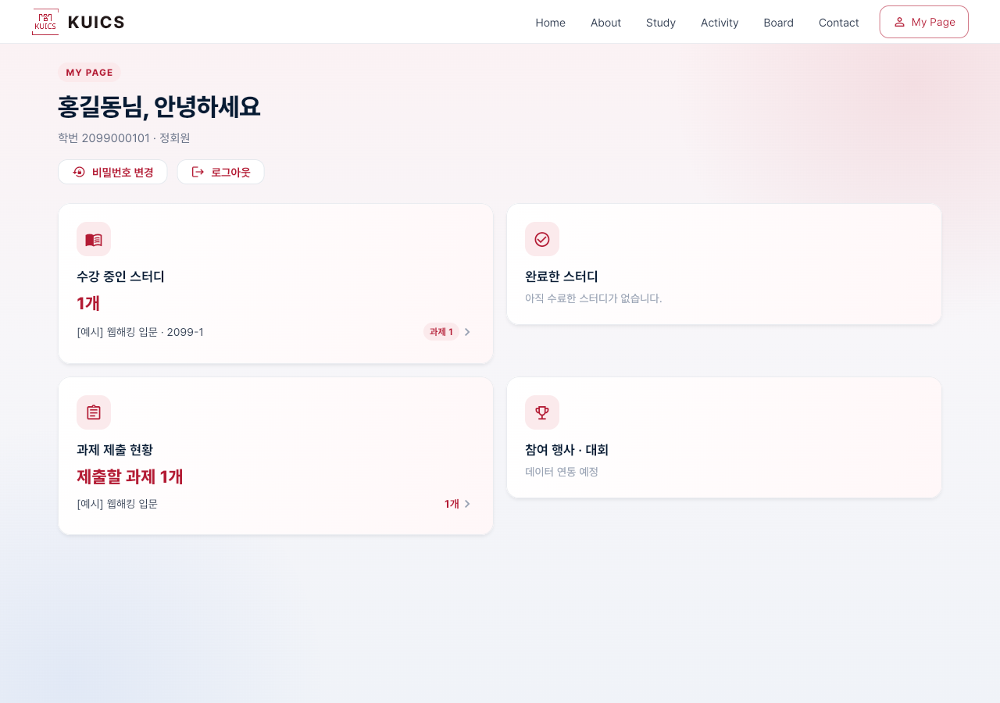
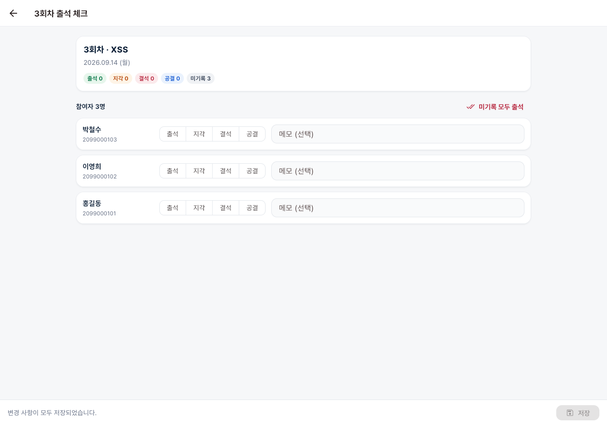
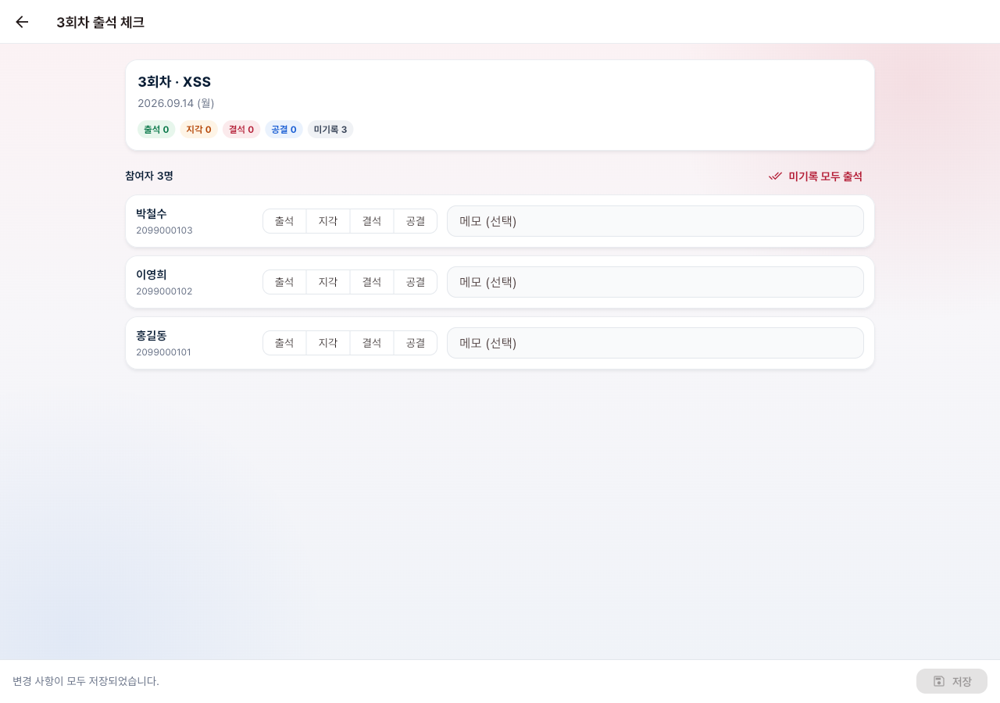
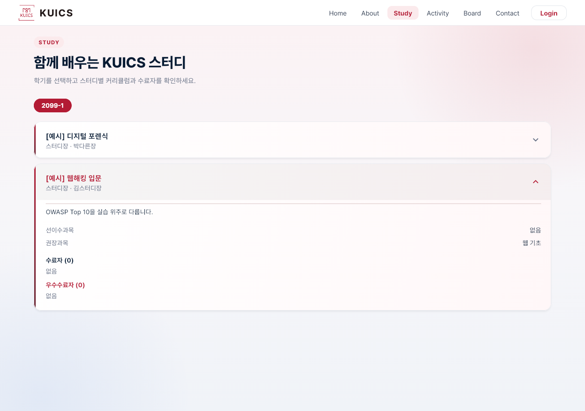

# 배경·카드 명암 다듬기 계획

작성일: 2026-09-14 / 브랜치: `dev_tweho`

## 배경

- 버튼·메뉴를 다듬었지만, 화면 바탕이 평평한 회색(`#F6F7F9`)이고 카드가 모두 흰색이다.
- 요청: 전체가 흰색·회색으로만 단조로우니, 배경과 스터디 구분 카드 등에 그라데이션과 그림자를 살짝 넣는다.

## 방향

크림슨·남색을 아주 옅게 섞어 온기를 준다. 글자 대비와 가독성은 해치지 않는다. 채도는 창 색 조정 뒤 기준처럼 낮게 둔다.

### 1. 화면 바탕 `AppBackdrop`

- **그라데이션**: 위에서 아래로 옅은 크림슨 기운(`#FBF2F4`) → 따뜻한 흰회색(`#F7F6F9`) → 옅은 남색 기운(`#F0F3F8`).
- **빛**: 오른쪽 위에 옅은 크림슨, 왼쪽 아래에 옅은 남색 빛을 크게 번지게 한다.
  - 스크롤해도 제자리에 있는 배경이다.
  - 누르기를 막지 않는다.
- **적용 위치**
  - 상단 메뉴가 있는 화면: `PageFrame`
  - 상세 화면 목록: `CenteredListView`
  - 로딩 중에도 튀지 않도록 바탕색(`scaffoldBackgroundColor`)을 그라데이션 가운데 색으로 맞춘다.
- **적용 방식**: 라우트 전환 중 페이지가 겹쳐 비치지 않도록, 앱 전체를 투명하게 만들지 않고 화면 틀 안에 칠한다.

### 2. 카드 `SoftCard`

- 기존 `Card`를 그대로 감싸서 테스트(`Card` 탐색)와 누름 효과를 유지한다.
- **바탕**: 흰색에서 오른쪽 아래로 아주 옅은 크림슨(`#FFF7F8`)으로 흐르는 그라데이션.
- **그림자**: 카드 그림자를 한 단계 진하게 한다(테마 `elevation 2 → 3`, 그림자 색 약간 진하게).
- **구분 막대**(`accent`): 왼쪽에 크림슨 → 짙은 크림슨 세로 막대(4px)를 둔다.
  - 스터디 카드
  - 게시글 카드
  - 스터디 관리 목록 카드

### 3. 적용 대상

| 카드 | 구분 막대 |
|---|---|
| Study 스터디 카드(펼침) | O |
| Board 게시글 카드(펼침) | O |
| 스터디 관리 목록 카드 | O |
| Home KUICS NOW 카드 | - |
| 마이페이지 요약 카드 | - |
| Contact 연락처 카드 | - |
| About 운영진 부서 카드 | - |
| 빈 결과·불러오기 실패 카드 | - |

- 참여자·출석·제출물처럼 정보가 빽빽한 관리용 카드는 읽기 편하도록 흰색을 유지한다(그림자만 테마로 조금 진해짐).

### 유지

- 문구·배치·동작은 그대로 둔다.

## 확인

- `flutter analyze`와 전체 위젯 테스트
- 로컬 빌드로 전 화면 전후 캡처(PC 1280, 휴대폰 390)
- 360px 폭 넘침·콘솔 오류·한글 대체 글꼴 다운로드 점검
- Study 카드를 펼친 모습 캡처
- 라우트 전환 중 겹쳐 비침이 없는지 확인

## 결과 (2026-09-14)

- **테스트**
  - `flutter analyze` 문제 0건, 위젯 테스트 59개 모두 통과. 테스트 수정은 없었다.
  - 카드는 안쪽이 그대로 `Card`여서 테스트 탐색이 유지된다.
- **실제 브라우저**(로컬 빌드 + 크롬)
  - 전 화면 캡처: PC 1280, 휴대폰 390
  - 360px 폭 19개 화면: 넘침 없음, 콘솔 오류 0건, 한글 대체 글꼴 요청 0건
- **Study 카드 펼침**: 구분 막대가 펼친 높이까지 이어지고, 그라데이션도 펼친 영역까지 자연스럽게 채워진다.
- **라우트 전환**
  - 스터디 관리 목록에서 상세로 넘어가는 중간(140ms) 캡처에서 이전 화면이 겹쳐 비치지 않았다.
  - 바탕을 앱 전체가 아니라 화면 틀 안에서 칠했기 때문이다.

| 화면 | 전 | 후 |
|---|---|---|
| Home (스터디장) |  |  |
| Home 휴대폰 |  |  |
| Study |  |  |
| 스터디 관리 |  |  |
| 마이페이지 |  |  |
| 출석 체크 |  |  |

Study 카드 펼침: 
