# 창(모달)·메뉴 디자인 통일 계획

작성일: 2026-09-14 / 브랜치: `dev_tweho`

## 배경

- 로그인 창의 새 디자인(흰 바탕, 크림슨 그라데이션 머리, 명암)을 요청대로 적용했다.
- 나머지 창·메뉴는 아직 Material 3가 크림슨에서 자동으로 만든 연분홍 단색이다.
- 요청: 원래 단색이던 모달들을 전부 같은 결로 바꾼다.

## 대상

| 종류 | 대상 |
|---|---|
| 창 | 로그인 · 비밀번호 변경(강제/선택) |
| 확인 창 (`confirmAction`) | 저장 안 한 출석 나가기, 과제·회차 삭제, 중도 포기 변경, 과제 제출·재제출 |
| 입력 창 | 회차 추가/수정, 과제 등록/수정, 제출물 피드백 |
| 팝업 메뉴 | 마이페이지/로그아웃, 과제·회차 ⋮ 메뉴, 참여 상태 변경 |
| 선택창 | 날짜 선택, 시각 선택 (Flutter 기본 창이라 테마로 색만 맞춤) |

## 설계

### 공통 틀 `widgets/app_dialog.dart`

- **`AppDialog`**
  - 흰 바탕, 모서리 20, 남색 그림자
  - 크림슨 그라데이션 머리: 흰 카드에 아이콘 또는 로고, 영문 머리말, 제목, 설명, 닫기 ✕
  - 본문만 스크롤된다.
  - 버튼은 아래 오른쪽에 둔다.
- **부품**
  - `DialogCallout`: 안내·오류 상자
  - `DialogPrimaryButton`: 크림슨 그림자 버튼
  - `DialogCancelButton`: 회색 글자 버튼
  - `dialogFieldDecoration`: 연회색 채움 입력칸. 초점이 가면 크림슨.
- **닫을 수 없는 창**: 강제 비밀번호 변경은 ✕를 두지 않고, 보조 버튼을 "로그아웃"으로 둔다.
- **저장 중**: ✕와 버튼을 막는다.

### 창마다

- **확인 창**: 목적별 아이콘을 쓴다.
  - 삭제: 휴지통
  - 제출: 업로드
  - 나가기: 문
  - 중도 포기: 사람 제외
- **입력 창**: 머리 설명으로 한 줄 도움말을 준다.
  - 회차: 출석 기록
  - 과제: 지각 제출 가능
  - 피드백: 파일 이름
- **메뉴**: 흰 바탕, 옅은 테두리, 그림자를 두고 버튼 아래로 열린다. 항목에 아이콘을 붙이고, 삭제는 크림슨으로 표시한다.
- **날짜·시각 선택창**: 흰 바탕에 크림슨 머리와 크림슨 강조를 쓴다.

### 유지

- 버튼 문구(취소·저장·삭제·제출·나가기·로그아웃·변경), 입력칸 라벨, 창 제목은 그대로 둔다. 테스트와 사용자 안내가 이 문구를 쓴다.
- 창의 동작(검증, 서버 오류 표시, 반환값)은 바꾸지 않는다.

## 확인

- 위젯 테스트: 기존 전부, 새 창 모양에서 확인·닫기·강제 변경·휴대폰 폭 넘침
- 로컬 빌드 캡처: PC와 360px 폭에서 각 창·메뉴·날짜/시각 선택창

## 결과 (2026-09-14)

- **위젯 테스트**: `test/dialog_design_test.dart` 10개를 추가해 전체 59개가 통과했다. `flutter analyze` 문제 0건.
  - 확인 창의 반환값(확인 true, 취소·닫기 false)
  - 강제 비밀번호 변경(닫기 없음, 로그아웃 반환)과 선택 변경(닫기)
  - 360px 폭에서 5개 창과 긴 확인 문구 넘침 없음
  - 창 제목이 제목 노드이자 창 이름인지
- **실제 브라우저**(로컬 빌드 + 크롬): PC와 360px 폭에서 모두 확인했고 콘솔 오류 0건.
  - 창: 회차 추가, 과제 등록(빈 제목 검증 포함), 피드백, 비밀번호 변경, 회차 삭제 확인
  - 선택창: 날짜, 시각
  - 메뉴: 마이페이지, 회차 ⋮, 참여 상태
- **점검 중 고친 것**: 창 머리의 제목이 웹 화면 낭독기에 노출되지 않았다. 머리 글자가 창 노드에 합쳐졌고, Flutter 웹은 창 노드의 라벨을 쓰지 않기 때문이다.
  - 제목 묶음을 `Semantics(container, header, namesRoute)`로 감쌌다.
  - 이제 창이 `aria-describedby`로 `<h2>` 제목을 가리킨다.
  - 장식용 아이콘·로고는 읽지 않게 했다.

| 대상 | 캡처 |
|---|---|
| 확인 창 (회차 삭제) |  |
| 회차 추가 | 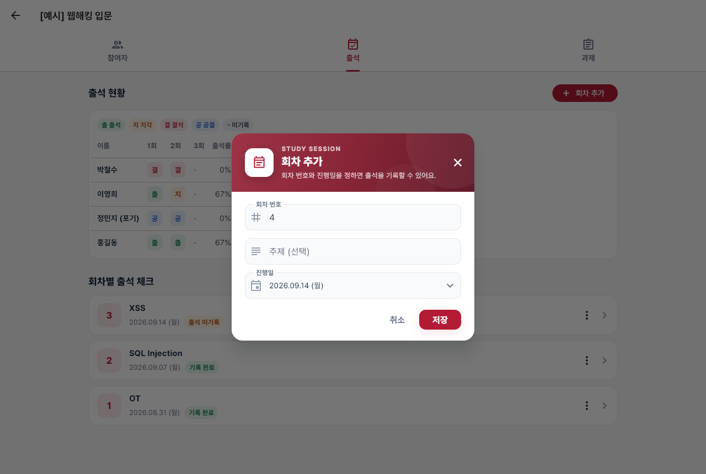 |
| 과제 등록 · 빈 제목 오류 | 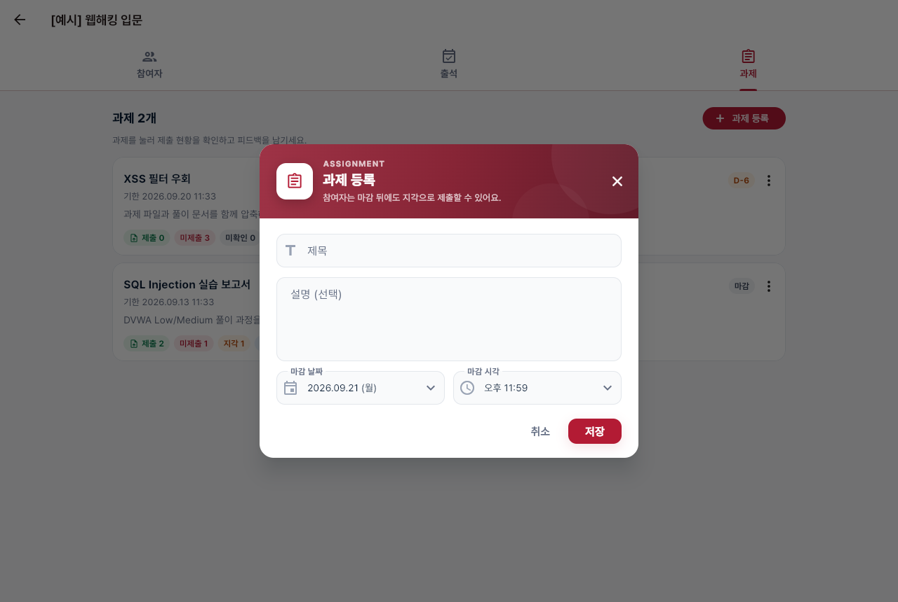 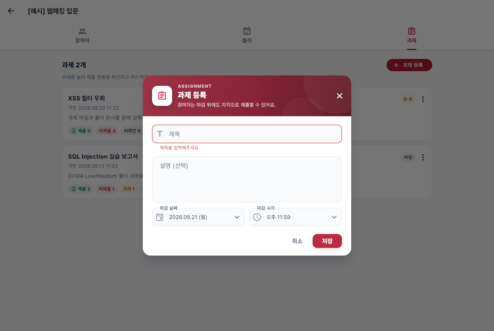 |
| 피드백 | 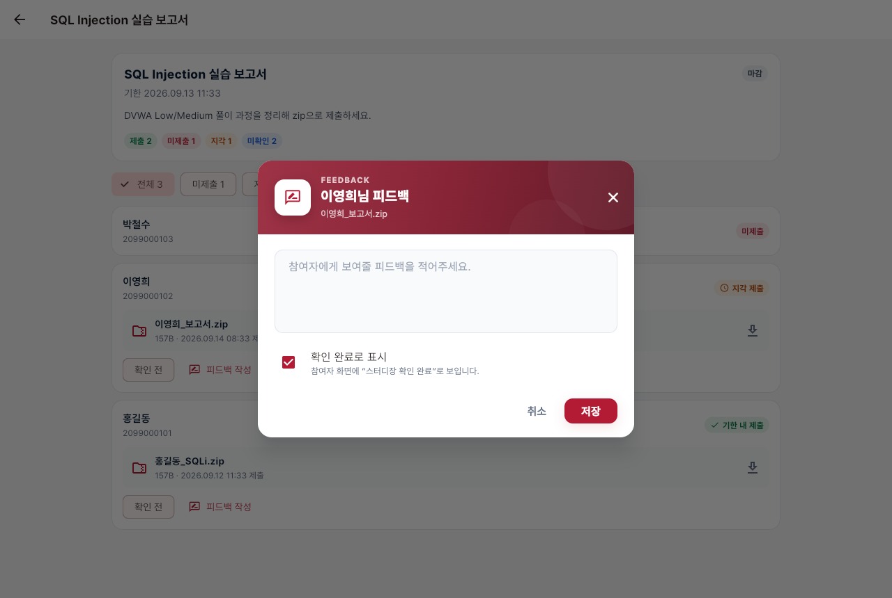 |
| 비밀번호 변경 | 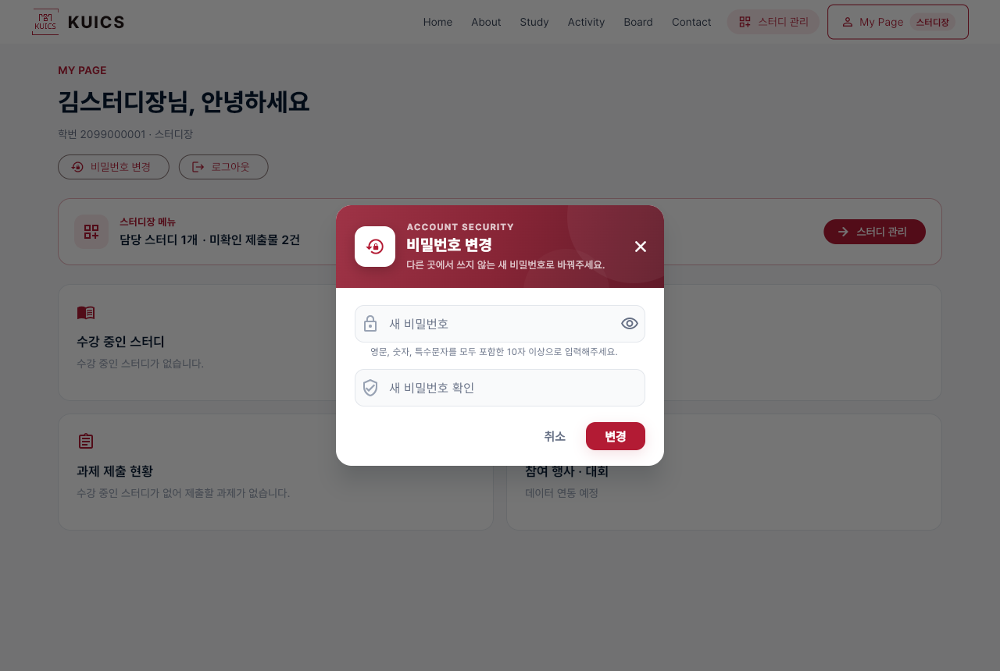 |
| 날짜 · 시각 선택창 | 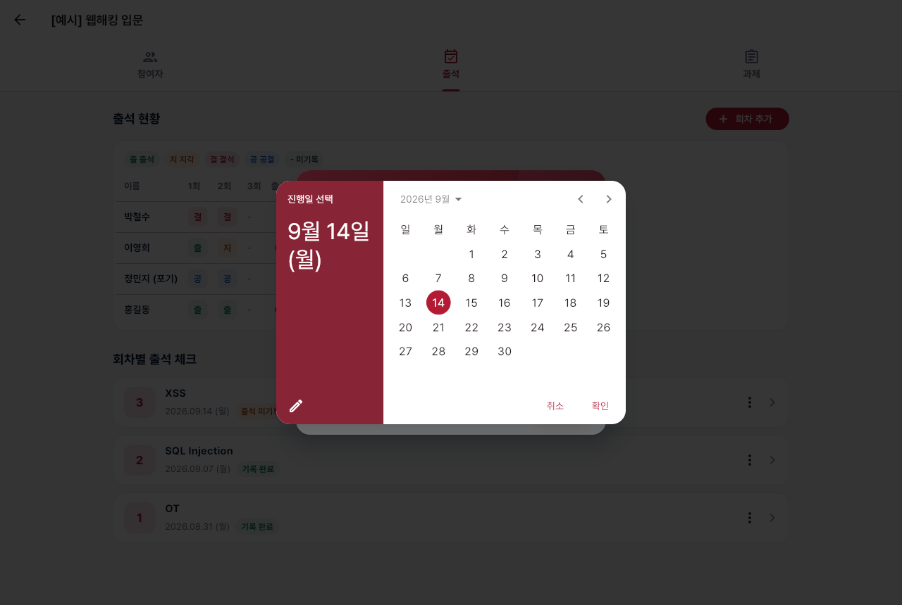 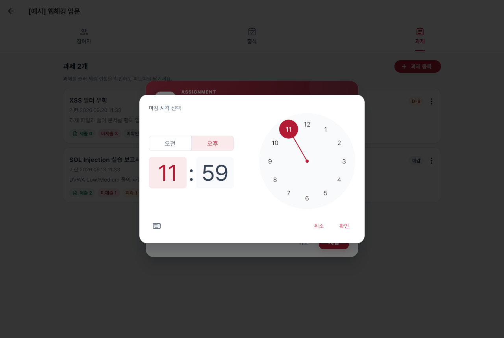 |
| 마이페이지 · 회차 · 참여 상태 메뉴 | 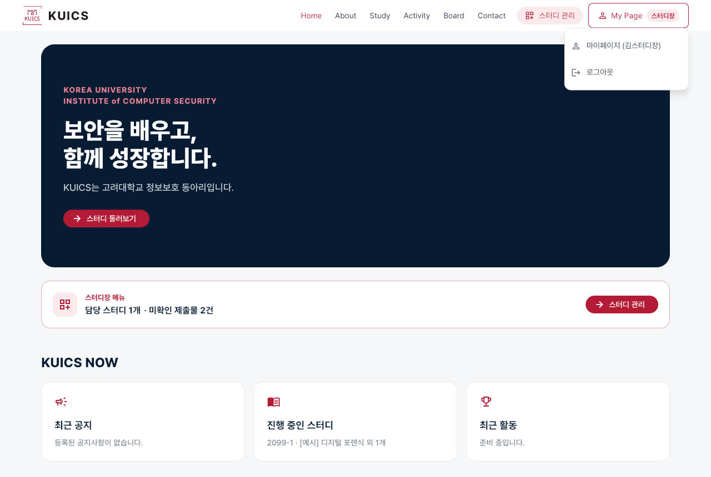 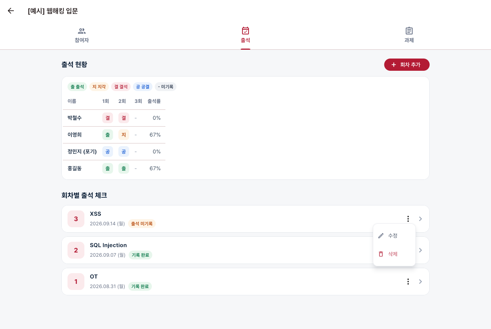 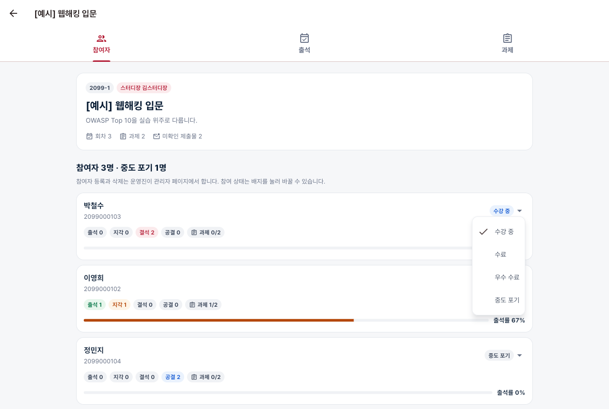 |
| 360px 과제 등록 · 삭제 확인 | 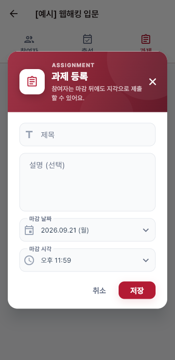 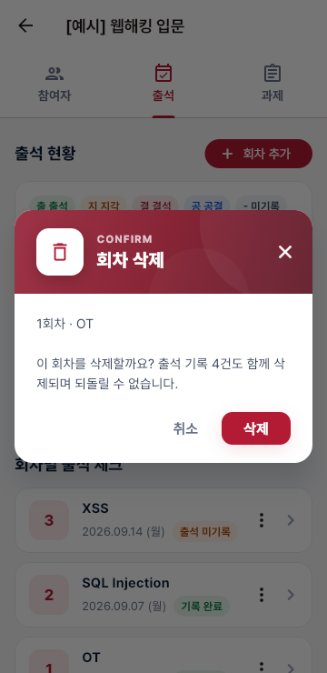 |

## 색 조정 (2026-09-14, "너무 쨍하다"는 의견)

모든 창에 공통으로 적용한다. 브랜드 크림슨(`#B31B34`)과 버튼 색은 유지하고, 넓게 칠해지는 면과 효과만 한 단계 낮춘다.

| 항목 | 전 | 후 |
|---|---|---|
| 머리 그라데이션 | `#D02A46 → #B31B34 → #7A0F22` | `#9E3346 → #872536 → #611A29` (채도·명도 낮춤) |
| 머리 빛 원 투명도 | 22 / 14 | 13 / 8 |
| 머리 설명 글자 | 흰색 84% | 흰색 78% |
| 주 버튼 그림자 | 크림슨 27%, 흐림 18, 아래 8 | 크림슨 13%, 흐림 14, 아래 5 |
| 안내·오류 상자 글자·아이콘 | `#B31B34` | `#93303F` |
| 안내·오류 상자 테두리 | 18% / 오류 43% | 13% / 오류 27% |
| 입력칸 초점 테두리 | 1.6 | 1.4 |
| 날짜 선택창 머리 | `#B31B34` | `#872536` |

| 전 | 후 |
|---|---|
| 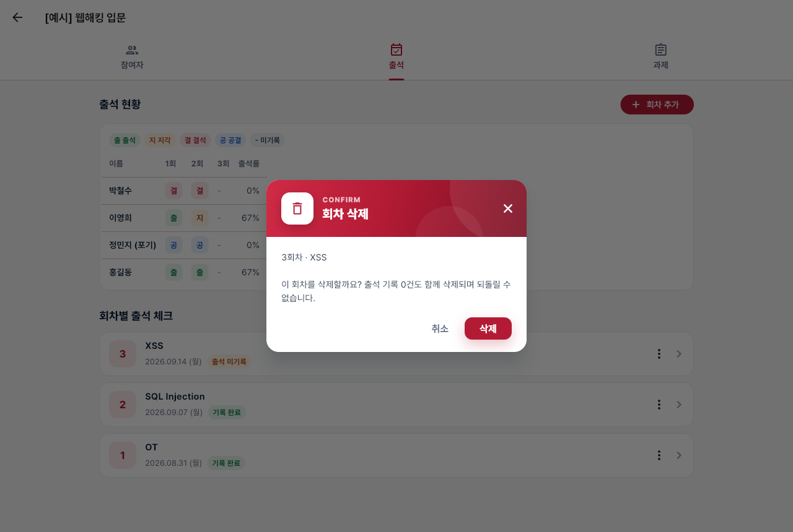 |  |

확인: 위젯 테스트 59개, 실제 브라우저 창·메뉴·선택창 16개와 로그인 창 13개 모두 통과. 캡처는 이 문서와 로그인 창 계획 문서의 이미지가 모두 조정 후 모습으로 바뀌었다.
