# 덜 "AI틱한" 디자인 · 좁은 화면 다듬기 계획

작성일: 2026-09-14 / 브랜치: `dev_tweho`

## 요청

1. 가로가 짧을 때(휴대폰 폭) 보이는 화면도 디자인을 다듬는다.
2. 모든 디자인을 덜 "AI틱"하게 바꾼다.

## "AI틱"하다고 본 요소 (지금 사이트 기준)

생성형 도구로 만든 랜딩 페이지·SaaS 템플릿에서 흔히 보이는 장식이다.

| 요소 | 현재 위치 |
|---|---|
| 흐릿하게 번진 빛 원(orb) | Home 히어로, 화면 바탕, 창 머리 |
| 모든 면에 깔린 그라데이션 | 창 머리, 카드 바탕, 화면 바탕, 구분 막대 |
| 영문 대문자 알약 머리말 | STUDY·BOARD 등 페이지 머리, 창의 CONFIRM·STUDY SESSION·ACCOUNT SECURITY·KUICS MEMBER |
| 파스텔 둥근 사각형 안 아이콘 | 모든 카드·창 머리·빈 결과 (`IconBadge`) |
| 연분홍 틴트 남발 | 머리말 배지, 아이콘 배지, 안내 상자, 카드 그라데이션 |
| 친근한 설명 한 줄 | 창 머리 설명("…할 수 있어요."), 인사말 아이콘(손 흔들기) |
| 크고 둥근 모서리 + 떠 있는 그림자 | 카드 16, 창 20, 버튼 그림자 |

## 방향: 장식을 줄이고 글자·간격·선으로 위계를 만든다

전 요청(그라데이션·그림자)은 없애지 않고 **존재감을 크게 낮춘다**. 크림슨은 브랜드 포인트로만 쓴다.

### 공통

- **모서리**: 카드 16 → 12, 창 20 → 14, 버튼 12 → 8, 칩은 알약 → 모서리 8.
- **그림자**
  - 떠 있는 그림자 대신 가까운 그림자(아래 1px, 흐림 3)와 선명한 1px 테두리를 쓴다.
  - 버튼의 크림슨 번짐 그림자를 없앤다.
- **화면 바탕**
  - 빛 원을 없앤다.
  - 위아래로 거의 티 나지 않는 중성 그라데이션(`#F7F7F5 → #F2F3F5`)만 남긴다.
- **카드**: 분홍 그라데이션 대신 흰색 → 아주 옅은 회백(`#FCFCFB`)으로 흐르게 하고, 구분 막대는 그라데이션 없는 단색 크림슨 3px.
- **페이지 머리말**: 알약 배지 대신 짧은 크림슨 선(16px) + 자간 넓힌 작은 영문 글자. 신문·잡지식.
- **아이콘**: 파스텔 사각형 배경을 없애고, 선 아이콘을 제목 옆에 작게 붙인다. `IconBadge` → `CardIcon`.
- **상단 메뉴**: 연분홍 알약 대신 현재 메뉴 아래 크림슨 2px 밑줄 + 굵은 글자, 올리면 글자색만 바뀐다.

### 창(모달)

- **머리**: 그라데이션·빛 원·아이콘 카드·영문 머리말을 없앤다. 창 맨 위에 크림슨 3px 띠를 두고, 제목은 남색 굵은 글자로 왼쪽 정렬, 닫기(✕)는 회색.
- **설명 문장**: 기능에 필요한 것만 남긴다. 피드백 창의 파일 이름, 로그인 창의 비밀번호 분실 안내는 유지.
- **안내·오류 상자**: 분홍 상자 + 아이콘 대신 왼쪽 크림슨 3px 선 + 옅은 회백 바탕 + 글자.
- **주 버튼**: 단색 크림슨, 번짐 그림자 없음.
- **로그인 창**: 제목 왼쪽에 작은 로고(28px)만 둔다.
- **동작 유지**: 제목을 창 이름으로 읽히게 한 접근성 처리는 그대로 둔다.

### Home

- **히어로**: 빛 원을 없앤다. 남색 단색에 가까운 아주 옅은 선형 그라데이션을 두고, 왼쪽에 크림슨 세로 막대 4px. 버튼 그림자는 줄인다.
- **KUICS NOW 카드**: 아이콘을 제목 옆 작은 선 아이콘으로 바꾸고, 이동 카드는 제목 오른쪽 작은 `›`로 표시한다.

### 좁은 화면(600px 미만)

- **한글 줄바꿈**: 단어 중간에서 줄이 바뀌지 않게 한다(띄어쓰기 단위 줄바꿈, CSS `keep-all`과 같은 효과). 적용 대상: 페이지 머리 설명, Home 소개 문구, About 소개 문단, 카드 설명·안내 문장.
- **여백과 크기**
  - 페이지 좌우 여백 24 → 20.
  - 페이지 제목 32 → 26.
  - 카드 안쪽 여백 24 → 18.
- **메뉴 서랍**
  - 위: 로고 + KUICS
  - 로그인했으면 이름·등급 카드
  - 메뉴 목록: 현재 메뉴는 크림슨 글자 + 왼쪽 막대
  - 아래: 로그인/로그아웃 버튼
- **히어로**: 휴대폰 폭에서 여백·글자 크기를 한 단계 줄인다.
- **스터디장 메뉴 판**: 휴대폰 폭에서 버튼을 가로 가득 채운다.

### 유지

- 문구(창 설명 문장 정리 제외)·배치·동작.
- 테스트가 쓰는 글자와 위젯 종류.
  - 창 제목 접근성 테스트는 머리말이 빠진 이름으로 기대값만 고친다.

## 확인할 점 (임시 결정)

- **Q-D1**: "AI틱함"의 기준은 사람마다 다르다.
  - 위 표의 요소를 줄이는 방향으로 먼저 진행한다.
  - 그라데이션·그림자를 아예 없애길 원하면 한 줄 수정으로 끌 수 있게 둔다.
- **Q-D2**: 영문 대문자 머리말(STUDY 등)을 한국어로 바꿀지.
  - 기존 문구 유지 원칙에 따라 영문을 그대로 두고 모양만 바꾼다.

## 확인

- `flutter analyze`, 전체 위젯 테스트
- 전후 캡처(PC 1280, 휴대폰 390) — 메뉴 서랍·창 포함
- 360px 폭 넘침·콘솔 오류·한글 대체 글꼴 다운로드 점검
  - 단어 단위 줄바꿈 처리가 대체 글꼴을 부르지 않는지 특히 확인

## 결과 (2026-09-14)

- **테스트**
  - `flutter analyze` 문제 0건, 위젯 테스트 59개 모두 통과.
  - 고친 테스트
    - `dialog_design_test`: 창 이름 기대값에서 영문 머리말(CONFIRM)을 뺐고, 확인 창 아이콘 검사를 없앴다.
    - `my_study_test`: 제출 확인 창 문장을 `KeepAllText`의 원래 문장으로 찾도록 바꿨다.
- **실제 브라우저**(로컬 빌드 + 크롬)
  - 전 화면 캡처(PC 1280, 휴대폰 390), 메뉴 서랍(손님·스터디장), 창 3종(로그인·회차 추가·삭제 확인) 캡처.
  - 360px 폭 19개 화면: 넘침 없음, 콘솔 오류 0건.
  - 경로별 한글 대체 글꼴 요청 0건. 줄바꿈 금지 문자(U+2060)가 대체 글꼴을 부르지 않는다.
- **계획과 다르게 한 것**
  - `IconBadge`는 이름을 바꾸지 않고 모양만 "배경 없는 선 아이콘"으로 바꿨다(호출부가 많아서).
  - 추가로 정리한 것
    - 구분선 기본색이 연분홍 기운이라 옅은 회색으로 바꿨다(`dividerColor`, `dividerTheme`).
    - 출석 탭·내 스터디의 회차 번호 사각형도 연분홍 → 회백 + 테두리 + 남색 숫자.
  - 확인 창 문장도 휴대폰 폭에서 단어 중간에서 끊겨 `KeepAllText`를 적용했다.
- **점검 중 고친 것**
  - **로고 잘림**: 메뉴 서랍·로그인 창의 로고를 가로·세로 모두 고정해 잘렸다. 로고가 정사각형이 아니어서 높이만 정했다.
  - **화면 낭독기**: `KeepAllText`는 줄바꿈 금지 문자가 섞인 글자를 그리므로, 읽을 때는 원래 문장(`semanticsLabel`)을 쓴다.
- **임시 결정 Q-D1·Q-D2**: 위 계획대로 진행했다.
  - 그라데이션은 바탕(`AppBackdrop`)과 카드(`SoftCard`) 한 곳씩에서만 정하므로 끄기 쉽다.
  - 영문 머리말은 페이지에만 남기고, 창에서는 뺐다.

| 화면 | 전 | 후 |
|---|---|---|
| Home (PC) | 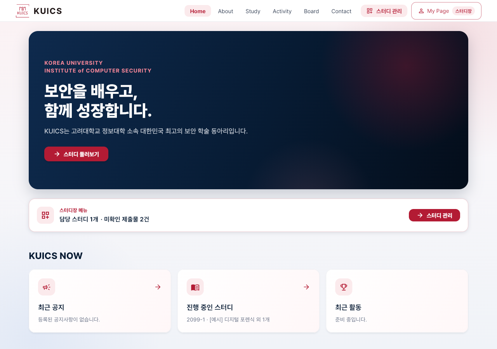 | 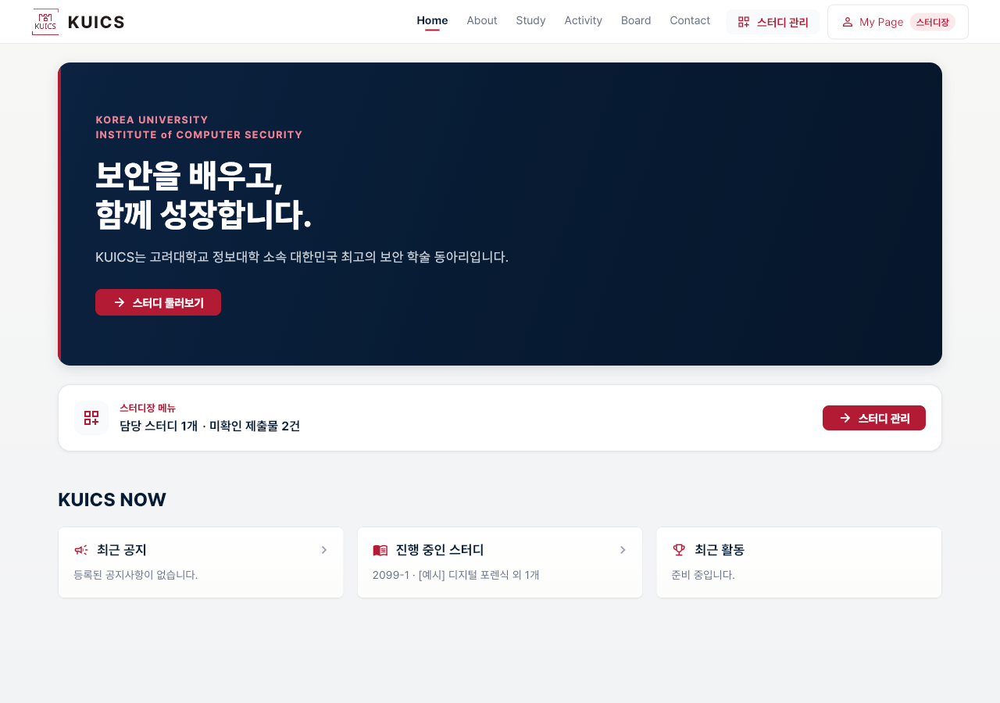 |
| Home (휴대폰) | 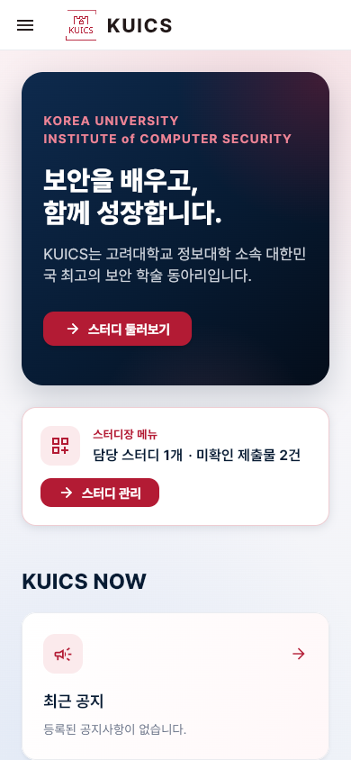 | 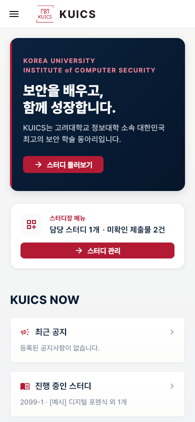 |
| Study (휴대폰) | 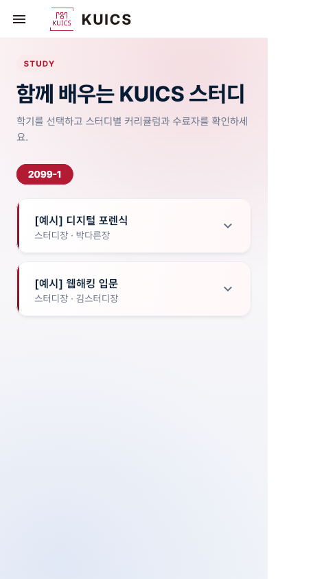 | 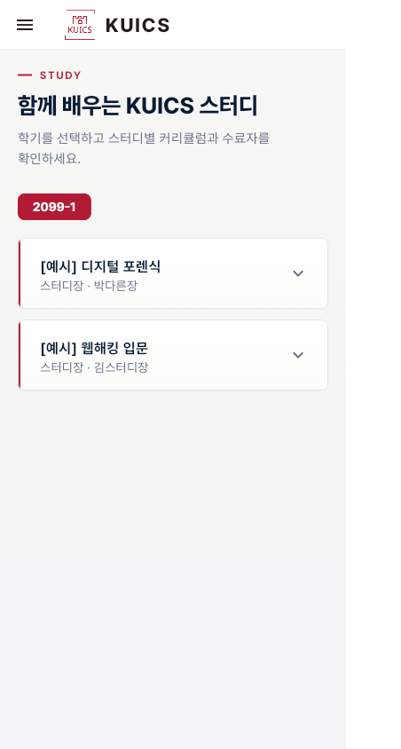 |
| About (휴대폰) | 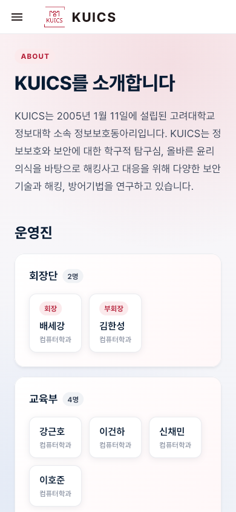 | 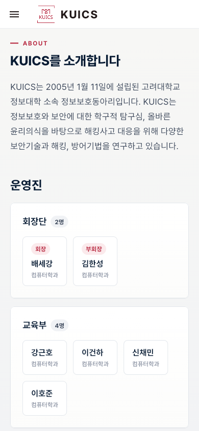 |
| 마이페이지 (PC) |  | 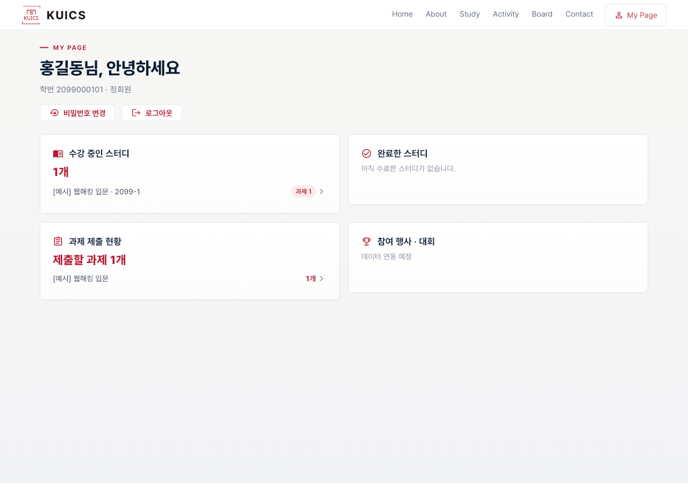 |
| 메뉴 서랍 (스터디장) | 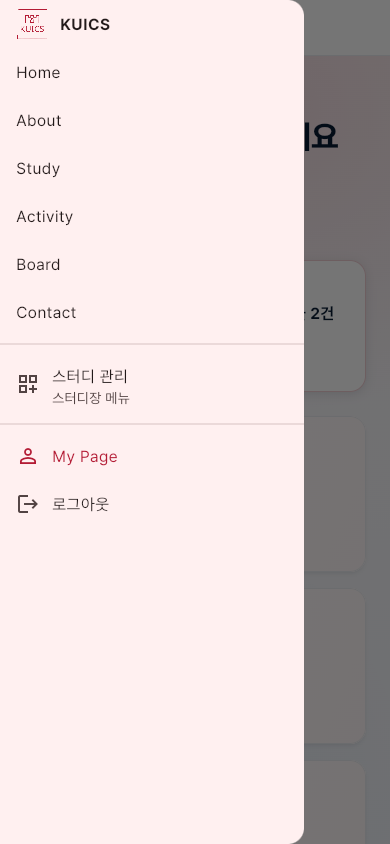 | 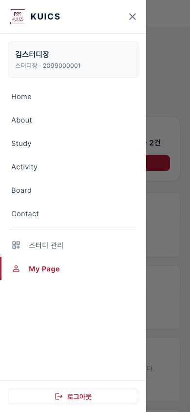 |

| 창 | 캡처 |
|---|---|
| 로그인 (휴대폰, 빈 입력) | 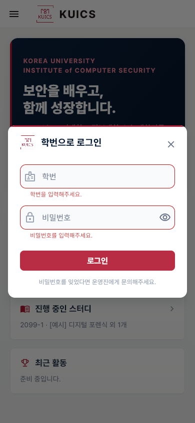 |
| 회차 추가 (PC) | 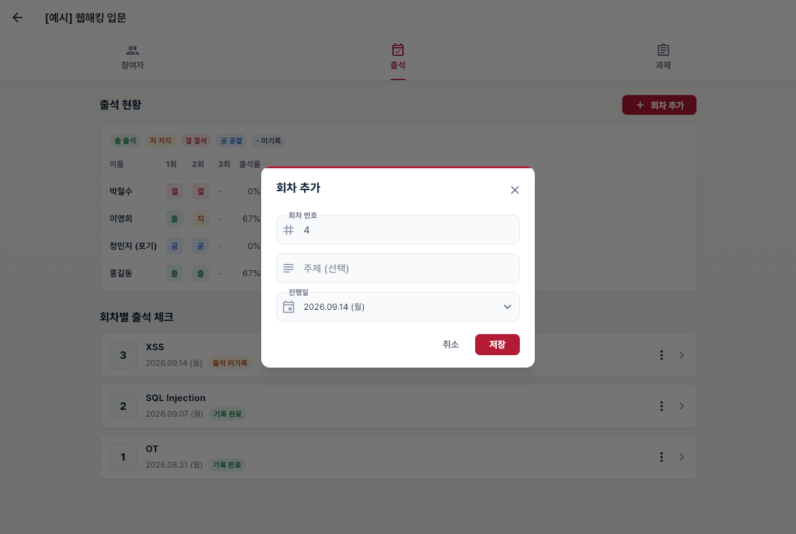 |
| 삭제 확인 (휴대폰) | 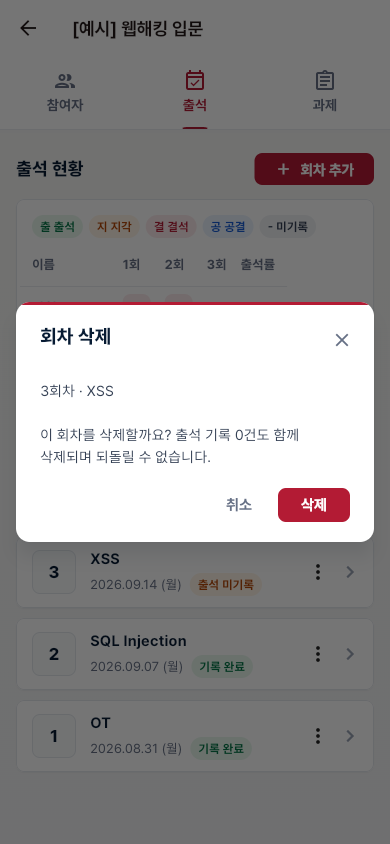 |
| 메뉴 서랍 (손님) | 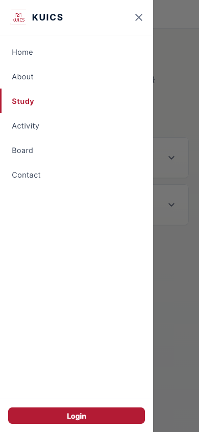 |
