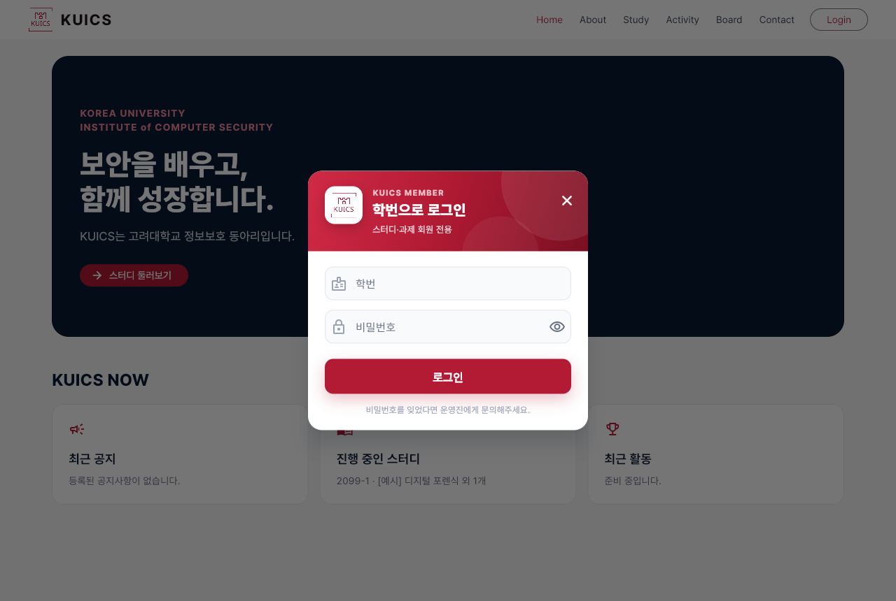
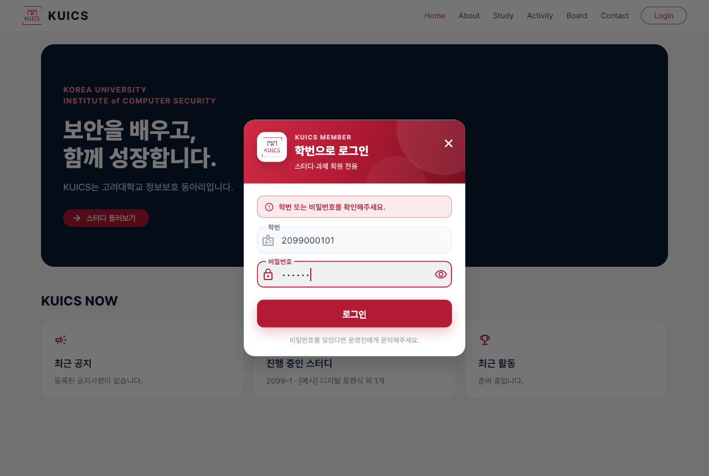
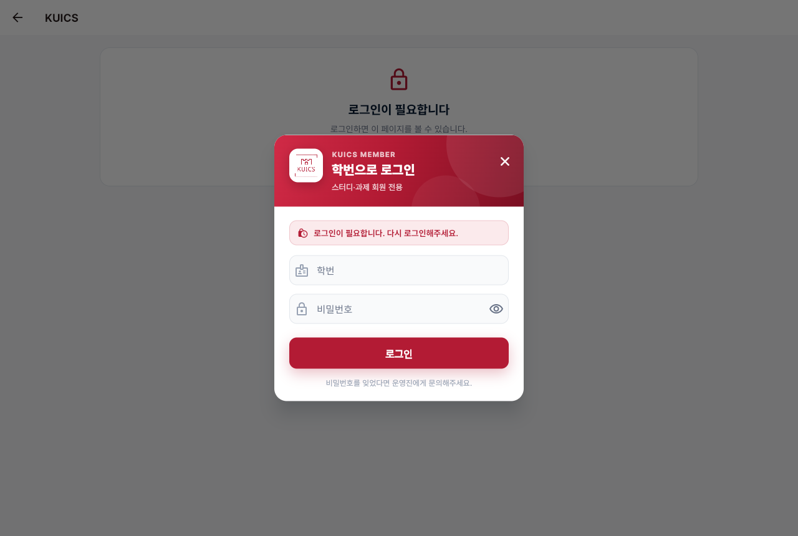
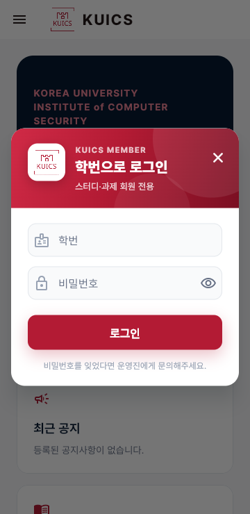
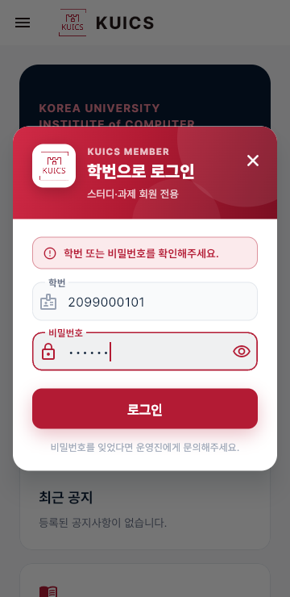

# 로그인 창 디자인 개선 계획

작성일: 2026-09-14 / 브랜치: `dev_tweho`

## 배경

- "학번으로 로그인" 창의 모양이 너무 단조롭다.
  - 창과 입력칸은 Material 3가 크림슨에서 자동으로 만든 연분홍 단색이다.
  - 그림자나 명암이 없다.
- 요청: 배경은 흰색으로 두고, 크림슨 색을 활용해 완성도를 높인다.
- 이번 범위는 로그인 창만이다. 다른 창은 추후에 맞춘다.

## 디자인

- **창**
  - 흰 배경, 모서리 20
  - 짙은 남색 계열의 부드러운 그림자
  - 휴대폰 폭에서는 좌우 여백 16
- **머리 영역**
  - 크림슨 대각선 그라데이션(밝은 크림슨 → 크림슨 → 짙은 크림슨) 위에 반투명 원 두 개로 명암을 준다.
  - 흰 카드에 로고를 넣고 그림자를 준다.
  - 문구: `KUICS MEMBER` / "학번으로 로그인" / 한 줄 설명
  - 오른쪽 위에 닫기(✕) 버튼
- **입력칸**
  - 연회색 채움, 모서리 12, 옅은 테두리
  - 초점이 가면 크림슨 테두리이고 아이콘·라벨도 크림슨
  - 학번은 숫자 키보드이고, Enter를 누르면 비밀번호로 이동
- **안내·오류**
  - 연크림슨 상자에 아이콘을 붙인다.
  - 세션 만료 안내(Q-04)는 자물쇠 아이콘, 로그인 실패는 경고 아이콘
- **로그인 버튼**
  - 가로 전체, 높이 50
  - 크림슨 그림자로 떠 보이게 한다.
- **아래 안내**
  - "비밀번호를 잊었다면 운영진에게 문의해주세요."
  - 초기 비밀번호 규칙은 화면에 노출하지 않는다.

## 유지할 것

- 라벨 "학번", "비밀번호", 버튼 "로그인", 제목 "학번으로 로그인"은 그대로 둔다. 테스트와 자동 점검이 이 문구를 쓴다.
- 로그인 흐름(API 호출, 오류 문구, 성공 시 회원 정보 반환)은 바꾸지 않는다.

## 확인

- 위젯 테스트: 안내 문구, 빈 입력 검증, 서버 오류 문구, 성공 시 창 닫힘
- 로컬 빌드 캡처: PC 폭과 360px 폭, 오류 상태와 안내 상태

## 결과 (2026-09-14)

- **위젯 테스트**: `test/login_dialog_test.dart` 4개를 추가해 전체 49개가 통과했다. `flutter analyze` 문제 0건.
- **실제 브라우저**(로컬 빌드 + 크롬): 13개 모두 통과, 콘솔 오류 0건. PC 폭과 360px 폭에서 각각 확인했다.
  - 창 열기
  - 빈 입력
  - 틀린 비밀번호
  - 닫기(✕)
  - Enter로 로그인
  - 세션 만료 안내(Q-04)
- **바뀐 동작**: 기존 "취소" 버튼 대신 머리 영역의 닫기(✕)로 창을 닫는다.
- **점검 중 고친 것**: 360px 폭에서 머리 설명이 "이용 / 하세요"로 어색하게 줄바꿈되어, 한 줄에 들어가는 "스터디·과제 회원 전용"으로 줄였다.

| 상태 | 캡처 |
|---|---|
| PC 기본 |  |
| PC 오류 + 입력 중 |  |
| PC 세션 만료 안내 |  |
| 360px 기본 |  |
| 360px 오류 + 입력 중 |  |
