# 사이트 전반 UI 다듬기 계획

작성일: 2026-09-14 / 브랜치: `dev_tweho`

## 배경

- 창(모달)을 다듬고 나니 나머지 화면이 상대적으로 딱딱해 보인다.
- 요청: Home, Activity 버튼을 비롯해 사이트 전반의 버튼·UI를 이번 창 작업 수준으로 다듬는다. 디자인만 살짝 바꾼다.

## 지금 딱딱해 보이는 이유 (캡처 점검)

| 부분 | 현재 |
|---|---|
| 버튼 | Material 기본 알약 모양, 명암 없음. 외곽선 버튼은 회색 테두리만 |
| 카드 | 흰 바탕에 회색 테두리만, 모든 카드가 같은 높이감. 눌러도 되는 카드인지 티가 안 남 |
| 상단 메뉴 | 현재 메뉴만 글자색이 바뀌고, 마우스를 올려도 반응이 약함 |
| 칩(학기·게시판 분류) | 기본 연분홍 체크 칩 |
| 페이지 머리 | 페이지마다 따로 만든 `STUDY` 빨간 글자 + 큰 제목 |
| Home 히어로 | 단색 남색 판 |
| Activity·빈 결과 | 작은 카드에 문장 한 줄 |

## 방향

창 작업과 같은 결로, 크림슨은 강조에만 쓰고 흰 바탕·옅은 그림자·둥근 모서리로 깊이를 준다. 채도는 창 색 조정 뒤 기준을 따른다.

### 테마 (`theme.dart`, 사이트 전체)

- **주 버튼(Filled)**: 모서리 12, 굵은 글자. 마우스를 올리면 크림슨 그림자가 살짝 생긴다.
- **외곽선 버튼**: 모서리 12, 옅은 테두리. 올리면 연크림슨 바탕.
- **글자 버튼**: 모서리 10.
- **카드**: 테두리를 한 단계 옅게 하고, 아주 옅은 남색 그림자로 바닥에서 살짝 뜨게 한다.
- **칩**
  - 알약 모양, 체크 표시 없음
  - 선택: 크림슨 바탕 + 흰 글자
  - 미선택: 흰 바탕 + 옅은 테두리
- **펼침 목록(스터디·게시글)**: 화살표를 크림슨으로, 펼친 제목도 크림슨으로.
- **입력칸**: 창 안 입력칸과 같은 연회색 채움 + 둥근 테두리. 출석 메모 등에 적용.
- **알림(스낵바)**: 남색 바탕, 둥근 모서리, 화면에서 떠 있는 모양.
- **로딩 표시**: 크림슨.

### 공통 부품 (`widgets/common.dart`)

- **`PageHeader`**
  - 머리말은 연크림슨 알약 배지, 제목은 굵고 자간을 살짝 좁힌다.
  - Study·Board·About·Contact·Activity·스터디 관리·마이페이지가 같이 쓴다.
- **`IconBadge`**: 연크림슨 둥근 사각형 안의 크림슨 아이콘. 카드 머리 아이콘을 통일한다.
- **`EmptyState`·`LoadError`**: 가로 가득, 가운데 아이콘 배지 + 문장. "다시 시도"는 외곽선 버튼.

### 화면별

- **상단 메뉴**
  - 마우스를 올리면 옅은 회색 알약.
  - 현재 메뉴는 연크림슨 알약 + 크림슨 굵은 글자.
  - Login·My Page 버튼 모서리 12. 상단바 아래에 옅은 경계선.
- **Home**
  - 히어로: 남색 그라데이션, 크림슨 빛 원 두 개로 명암. 버튼을 키우고 그림자를 준다.
  - KUICS NOW 카드
    - 아이콘 배지
    - 눌러서 이동하는 카드에는 오른쪽 위 크림슨 화살표 (준비 중인 카드는 본문에 이미 "준비 중입니다."가 있어 배지를 달지 않음)
- **Activity**: 가로 가득한 안내 카드에 트로피 아이콘 배지, 문장, "준비 중" 배지.
- **Contact**: 아이콘 배지, 오른쪽 이동 아이콘을 원형 버튼 모양으로.
- **About**: 부서 머리에 인원 배지. 운영진 칸은 흰 바탕 + 옅은 그림자, 직책은 크림슨 알약.
- **마이페이지·스터디 관리 카드**: 머리 아이콘을 `IconBadge`로.

### 유지

- 문구·라벨·화면 구성·동작은 바꾸지 않는다. 테스트가 쓰는 글자와 위젯 종류(`FilledButton`, `ChoiceChip` 등)를 그대로 둔다.
- 창(모달) 디자인은 이미 다듬었으므로 건드리지 않는다.

## 확인

- **테스트**: `flutter analyze`, 전체 위젯 테스트.
- **캡처 전후 비교**: PC 1280, 휴대폰 390에서 전 화면.
  - Home(손님·스터디장), About, Study, Activity, Board, Contact
  - 마이페이지(스터디장·참여자), 스터디 관리, 참여자 탭, 출석 체크, 제출 현황, 내 스터디 상세
  - 가로 넘침 검사

## 결과 (2026-09-14)

- **테스트**
  - `flutter analyze` 문제 0건, 위젯 테스트 59개 모두 통과.
  - 문구·위젯 종류를 그대로 둬서 테스트는 고치지 않았다.
- **실제 브라우저**(로컬 빌드 + 크롬)
  - 전 화면 캡처: PC 1280, 휴대폰 390
  - 360px 폭 가로 넘침 검사: 19개 모두 통과, 콘솔 오류 0건
- **추가로 반영한 것**
  - 출석 상태 선택(출석·지각·결석·공결)의 짙은 기본 테두리를 옅은 테두리 + 둥근 모서리로 바꿨다.
  - 메뉴 폭이 넓어져, 상단 메뉴가 서랍으로 바뀌는 폭을 820/1040 → 880/1100으로 올렸다.
- **점검 중 고친 것**
  - **한글 대체 글꼴 다운로드**
    - 증상: 칩(게시판 분류, 제출 현황 필터)에서 Noto Sans KR를 다시 받아왔다.
    - 원인: 칩 테마의 상태별 글자 모양(`WidgetStateTextStyle`)을 칩이 그대로 글자 모양으로 써서 테마 글꼴(Pretendard)이 빠졌다.
    - 수정: 일반 글자 모양과 선택 시 `secondaryLabelStyle`로 바꿨다.
    - 결과: 전 화면에서 대체 글꼴 요청 0건.
  - **버튼 글꼴**: 상단 메뉴와 창 버튼처럼 버튼 글자 모양을 직접 정한 곳에도 `fontFamily: 'Pretendard'`를 넣었다.
- **참고**
  - Home 소개 문구는 작업 중 작업 트리에서 바뀐 새 문구("KUICS는 고려대학교 정보대학 소속 대한민국 최고의 보안 학술 동아리입니다.")를 그대로 유지했다.
  - 이 문구가 길어져 휴대폰 폭에서 "대한민 / 국"으로 줄이 바뀐다.

| 화면 | 전 | 후 |
|---|---|---|
| Home (스터디장) | 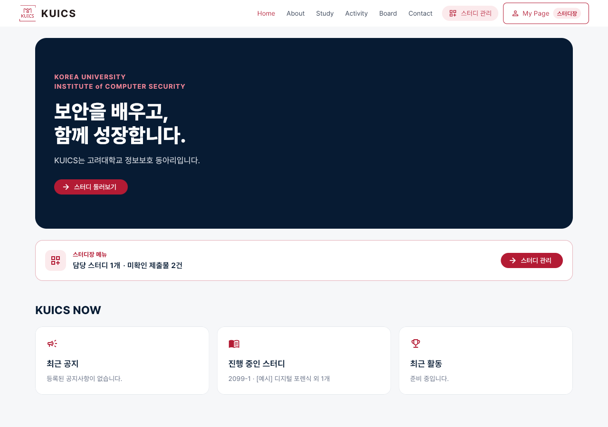 |  |
| Home 휴대폰 | 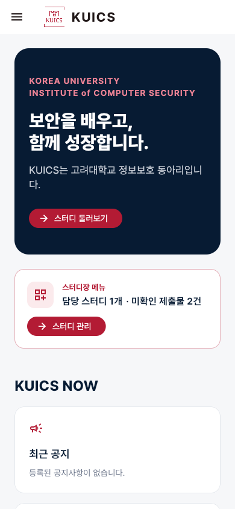 |  |
| Activity | 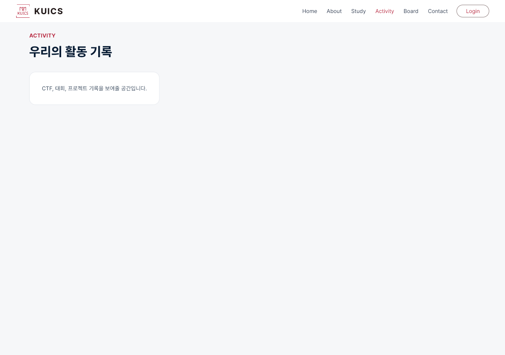 | 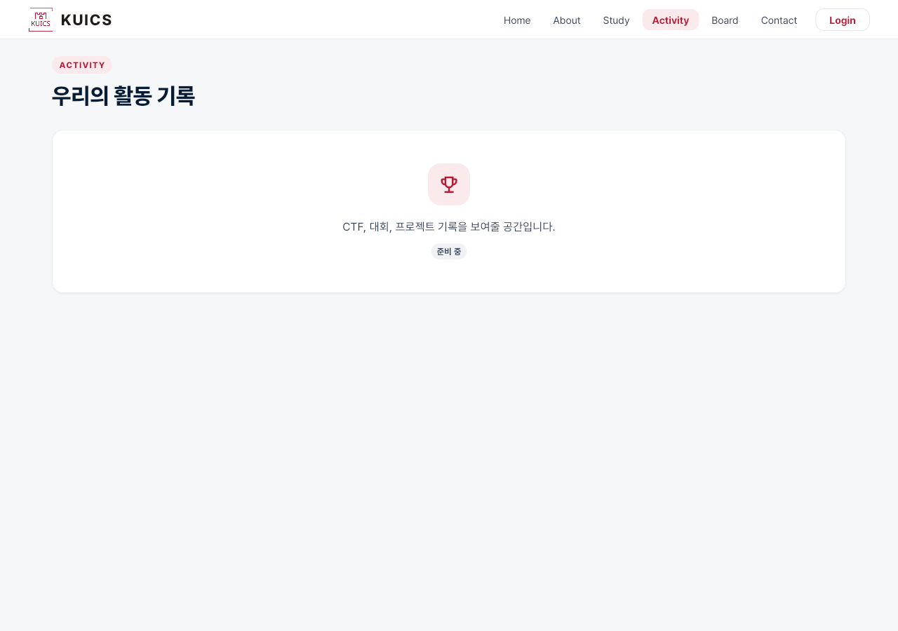 |
| Study | 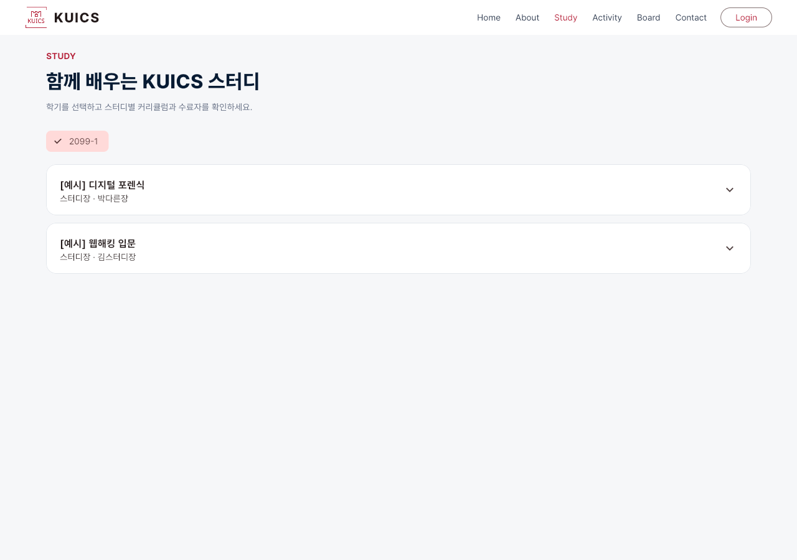 |  |
| Board | 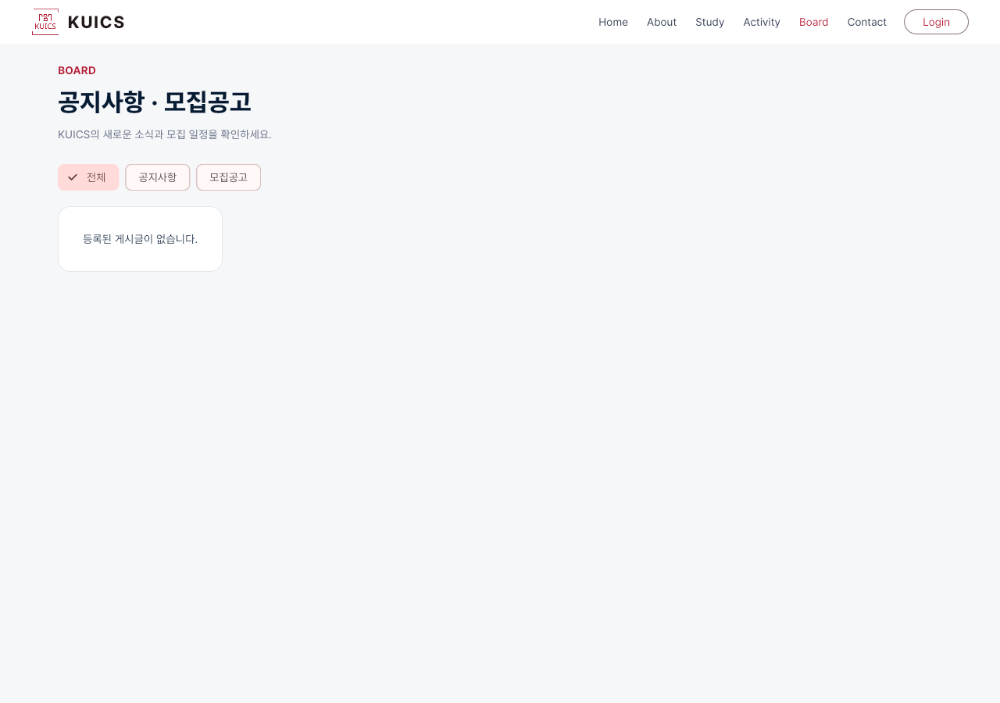 | 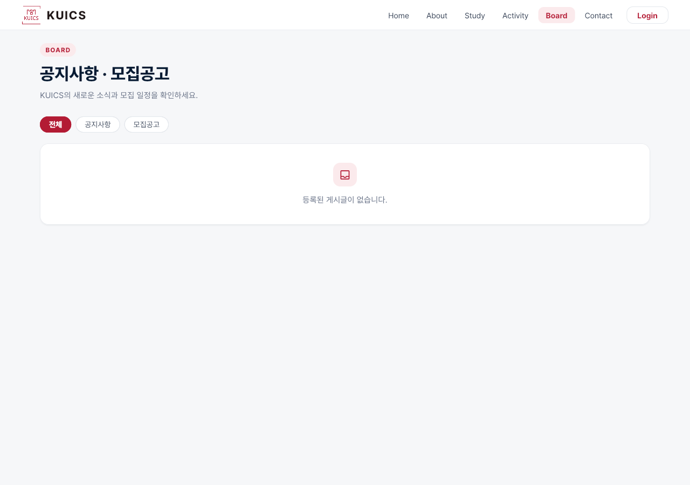 |
| About | 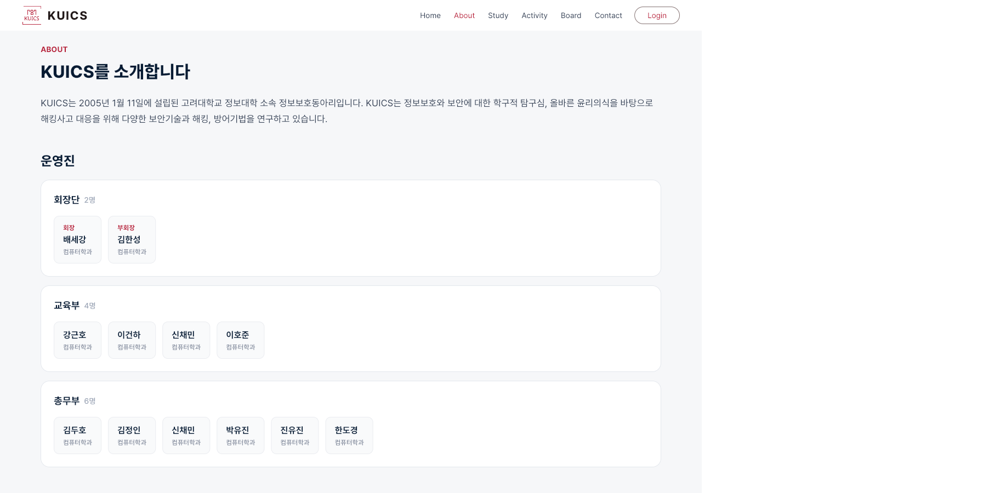 | 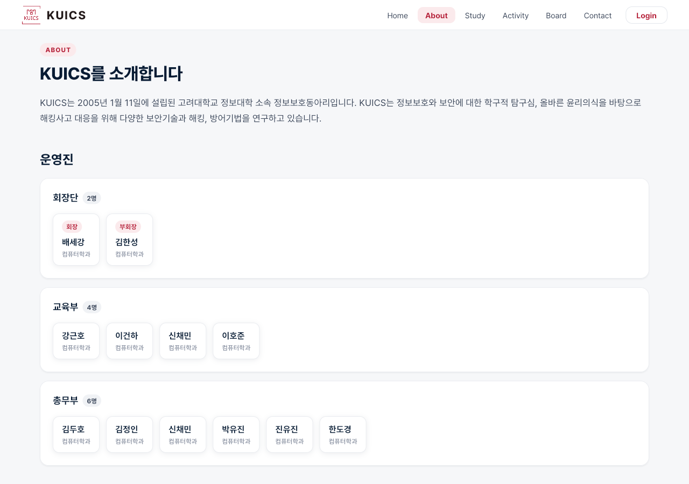 |
| Contact | 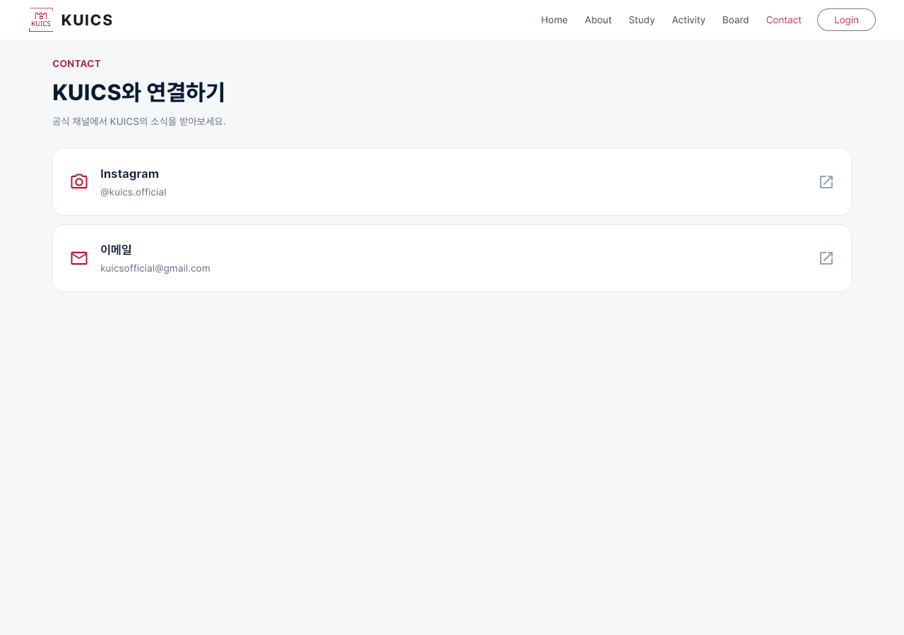 | 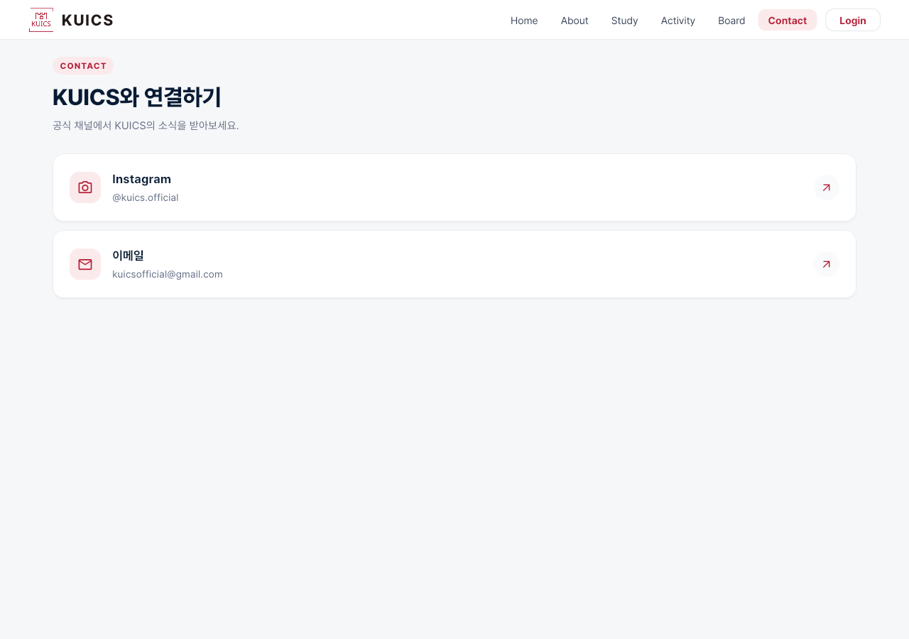 |
| 마이페이지 | 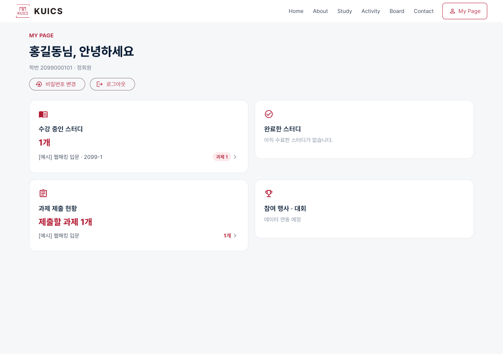 | 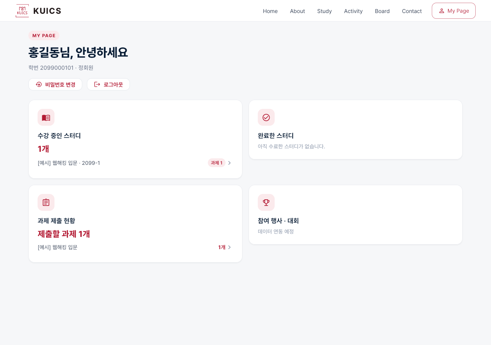 |
| 출석 체크 | 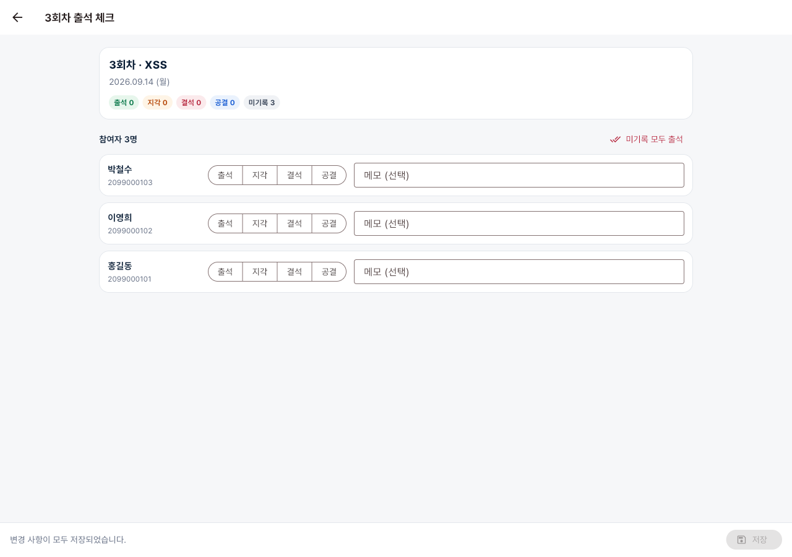 |  |
